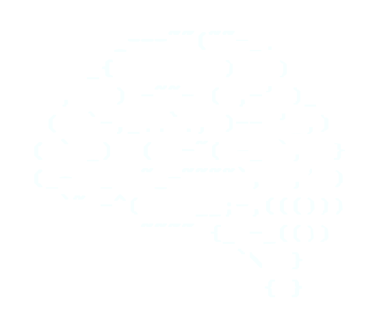

# Welcome to my big  github profile!

Hi, I'm currently at UQAM finishing a bachelors degree in computer science specifically software engineering and I already finished a technique in computer science at Cegep du Vieux Montréal. I worked as a system administrator and now I'm looking for a job position as a developper or cybersecurity researcher. 

-  I’m currently working on ...
    -
    - Hack the box CTF
    - Volvo canbus hacking
    - Raspberry Pi car headunit

-  I’m currently learning ...
    -
    - CI/CD implementation

-  I’m looking to collaborate on ...
    -
    - Nextcloud opensource project

